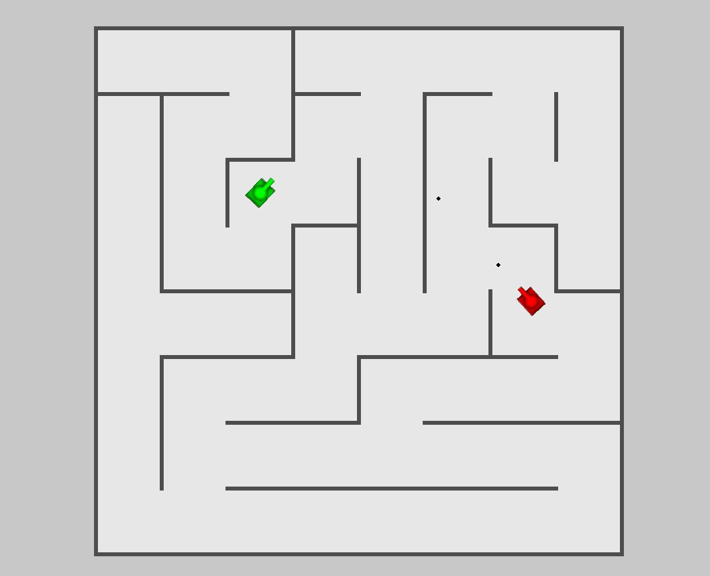

# Tank-Trouble

A recreation of a 2-player flash game "Tank Trouble", written in python. Includes controller support. Uses a recursive depth first search maze carving algorithm. Uses separating axis theorem for collision detection.

